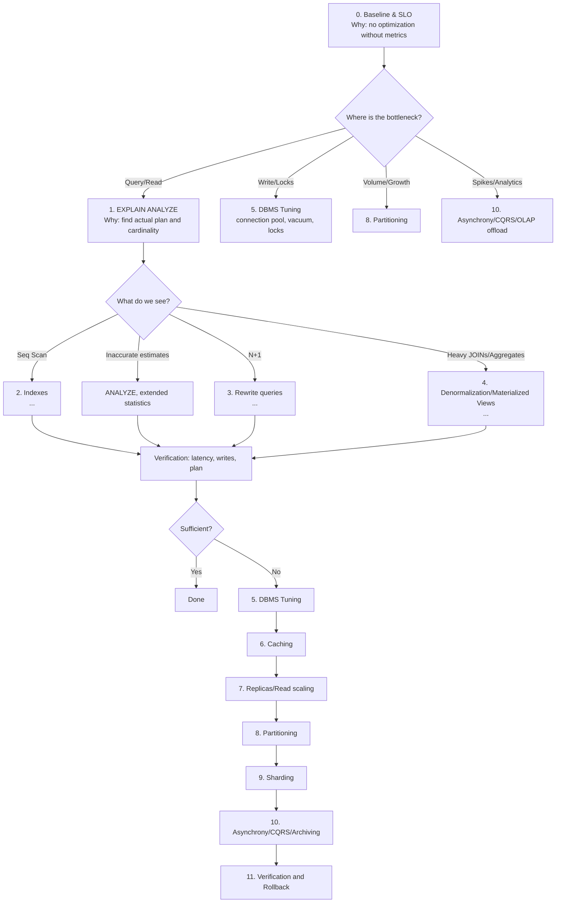
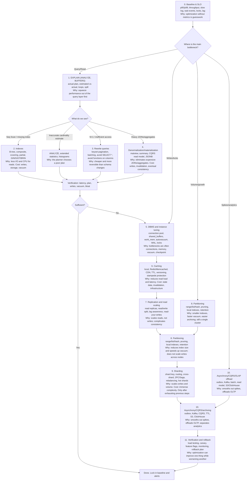

# Database optimization tree

The order in which this is usually applied
| Approach      | Description |
| ------------- | ------------- |
| Indexing      | the cheapest and most localized option. Always start here |
| Replication   | for when read volume is high, but write performance is still holding up |
| OLTP/OLAP separation | for when analytics start interfering with transactions |
| Denormalization      | for when JOINs and aggregations become too costly |
| CQRS          | for when read and write models have truly diverged |
| Sharding      | for when data volume or write load exceeds a single node's capacity |

In simple terms:

**Indexing** — a "book's table of contents." Fast to look things up, but every edit requires updating the index.

**Replication** — "copies of the book in different rooms." Everyone can read, but copies update with a delay.

**OLTP/OLAP** — "cash register vs. accounting." Cash register = fast operations; accounting = heavy reports. Don't mix them.

**Denormalization** — "keeping the answer ready instead of calculating it every time." Faster to read, harder to write.

**Sharding** — "splitting the book into volumes kept in different buildings." Scalable, but finding what you need is harder.

**CQRS** — "separate entrances for reading and writing." Each does its job well, but they need to be synchronized.

One rule
Go from top to bottom: index → ​​replica → separation → denormalization → CQRS → sharding.

Each subsequent step is more expensive than the last and harder to roll back.

## Simple Tree

## Top-level tree

```mermaid
flowchart TD
        A["Problem: DB is slow / overloaded"] --> B{"What's the pain point?"}

        B -->|"Slow reads"| C["Indexing<br/>Purpose: fast search without full scans<br/>Cost: slows down writes, consumes space"]
        B -->|"Insufficient read capacity"| D["Replication<br/>Purpose: distribute reads across multiple nodes<br/>Cost: lag, eventual consistency"]
        B -->|"Mixed analytics and transactions"| E["OLTP / OLAP separation<br/>Purpose: analytics don't interfere with transactions<br/>Cost: separate infrastructure, ETL"]
        B -->|"Expensive JOINs and aggregates"| F["Denormalization<br/>Purpose: eliminate JOINs, read pre-computed data<br/>Cost: data duplication, complex writes"]
        B -->|"Capacity / write limits exceeded"| G["Sharding<br/>Purpose: horizontally scale writes and storage<br/>Cost: complexity, cross-shard queries"]
        B -->|"Divergent read and write patterns"| H["CQRS<br/>Purpose: separate write model and read model<br/>Cost: synchronization, eventual consistency"]

        C --> C1["B-tree — standard comparisons and sorting"]
        C --> C2["Composite — multiple columns in a single index"]
        C --> C3["Partial / covering — only the necessary subset"]
        C --> C4["GIN / GiST / BRIN — JSON, search, geo, time-series"]

        D --> D1["Read replicas — scaling reads"]
        D --> D2["Read/write split — application knows where to direct requests"]
        D --> D3["Lag — application must tolerate latency"]

        E --> E1["OLTP — fast, short transactions"]
        E --> E2["OLAP — heavy analytics on a separate store"]
        E --> E3["ETL / CDC — data transfer between them"]

        F --> F1["Materialized view — precomputed result"]
        F --> F2["Column duplication — fewer JOINs"]
        F --> F3["Precomputed counts — avoid on-the-fly calculation"]

        G --> G1["Shard key — how data is partitioned"]
        G --> G2["Routing — how the application finds the right shard"]
        G --> G3["Cross-shard — the most expensive operation"]

        H --> H1["Write model — normalized, strict"]
        H --> H2["Read model — denormalized, fast"]
        H --> H3["Synchronization — events, queues, outbox"]
```

## Detailed Tree

