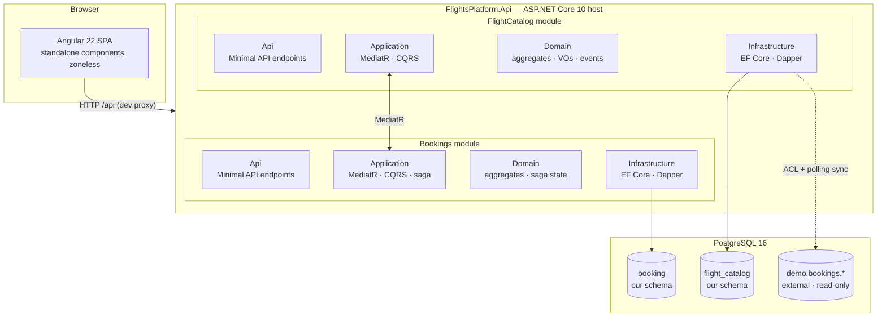
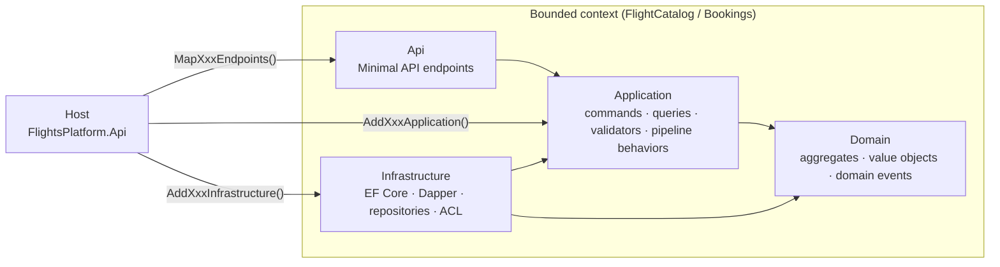
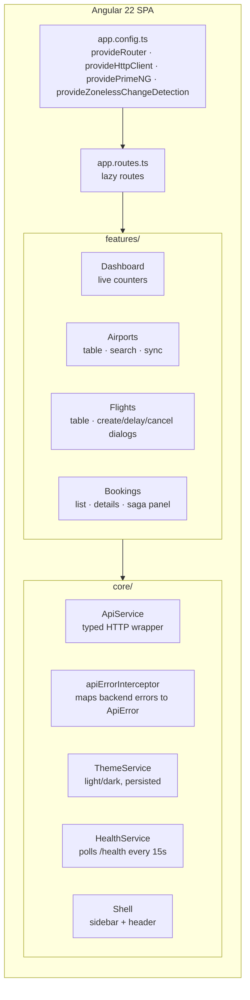
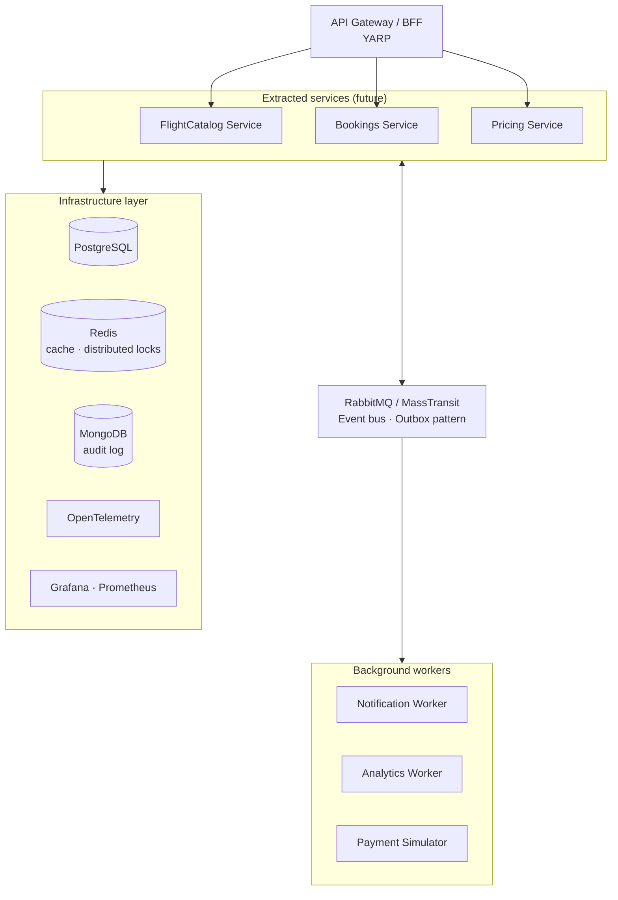
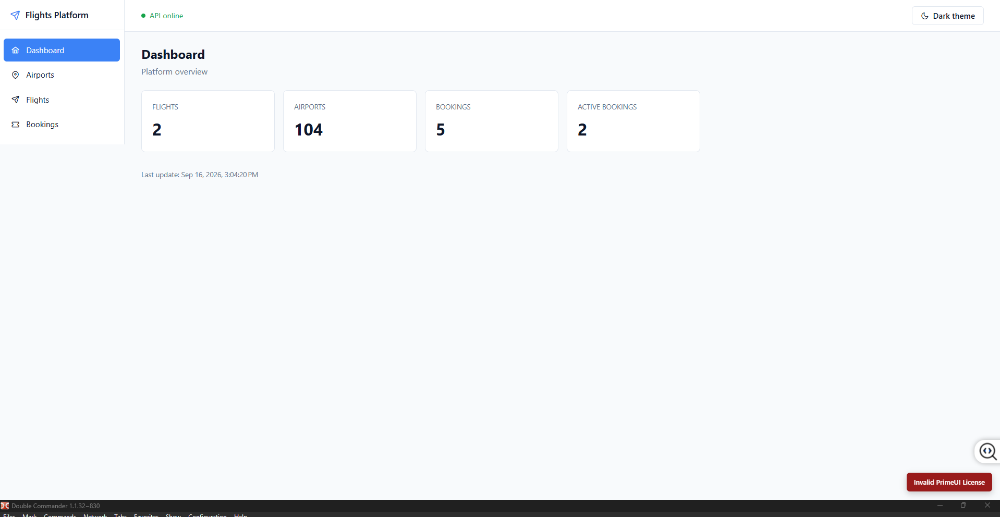
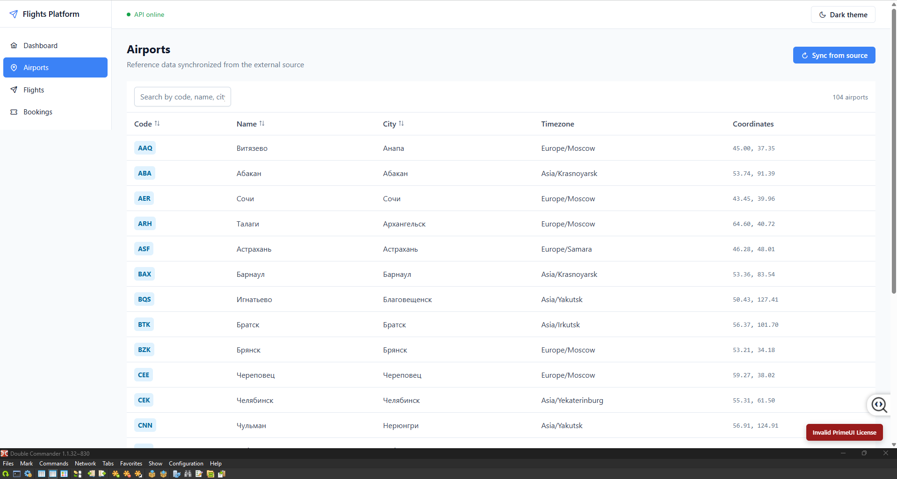
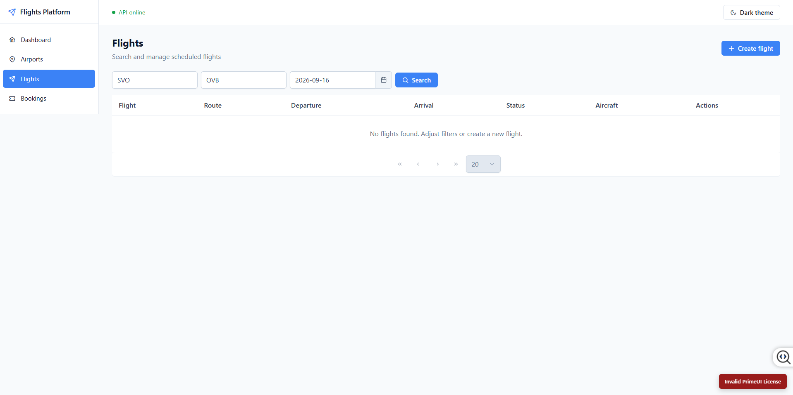
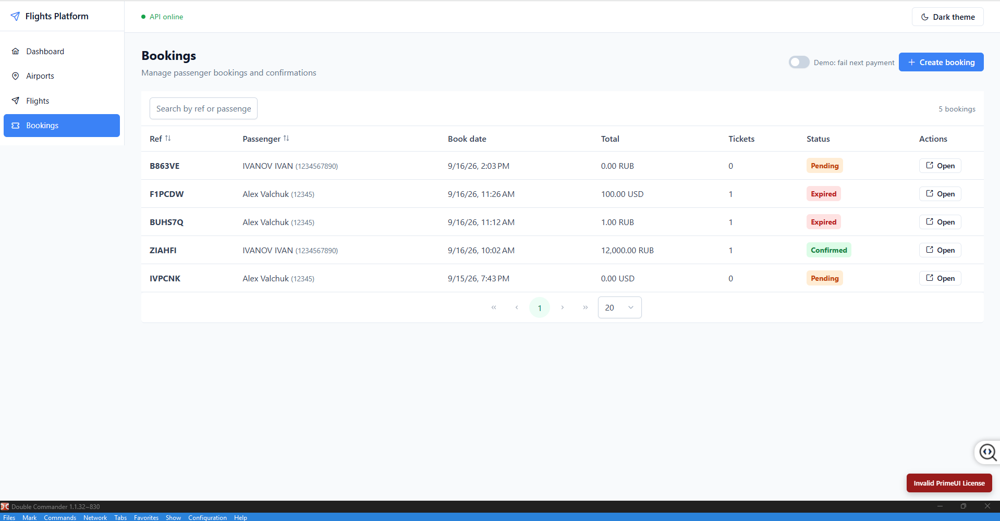

# Flights Platform

[](https://github.com/alex-valchuk/PracticalHighVolume/actions/workflows/ci.yml)
[](https://dotnet.microsoft.com/)
[](https://angular.dev/)
[](https://www.postgresql.org/)
[](LICENSE)

> A **journey from modular monolith to microservices** — a working
> distributed-systems platform with Clean Architecture, CQRS, DDD,
> saga orchestration with compensations, and event-driven messaging,
> built on a real Postgres demo database with millions of rows.

---

## Table of Contents

- [About](#about)
- [Highlights](#highlights)
- [Architecture](#architecture)
  - [System overview](#system-overview)
  - [Backend: modular monolith](#backend-modular-monolith)
  - [Frontend: Angular SPA](#frontend-angular-spa)
  - [Target architecture (roadmap)](#target-architecture-roadmap)
- [From monolith to services](#from-monolith-to-services)
- [Screenshots](#screenshots)
- [Tech stack](#tech-stack)
- [Getting started](#getting-started)
- [End-to-end walkthrough](#end-to-end-walkthrough)
- [Project structure](#project-structure)
- [Architecture Decision Records](#architecture-decision-records)
- [Roadmap](#roadmap)
- [License](#license)

---

## About

Flights Platform is a showcase of microservices patterns. It shows, in runnable code, how a
system **evolves from a modular monolith into microservices** without
rewriting the domain.

**The path — not the destination**

Each module is built as if it will be extracted into a service: its own
bounded context, its own schema, its own migrations, its own API surface.
Modules today communicate in-process via MediatR; tomorrow the same calls
become gRPC and the same domain events become RabbitMQ messages. The
**domain and application layers do not change**.

This is a **distributed system in the making**, with every phase moving
it closer to independent deployability. See the
[target architecture](#target-architecture-roadmap) and the
[roadmap](#roadmap) for the sequence.

**What that requires, and what this repo demonstrates**

- Keeping a domain pure while integrating with a legacy database.
- Splitting a system into bounded contexts with enforced boundaries.
- Coordinating multi-step business processes with **sagas** and
  **compensating transactions**.
- Event-driven communication between contexts (Phase 6).
- Caching, distributed locks, observability, and orchestration
  (Phases 5–8).
- Exposing the whole thing to a modern frontend that makes the saga visible.

The domain is airline booking. The external data source is the
[Postgres Pro demo database](https://edu.postgrespro.ru/) — a real dataset
with airports, flights, and tickets. Everything is built, tested, and
shipped through CI.

---

## Highlights

**Design for extraction**

- **Two bounded contexts** — `FlightCatalog` (schedule, airports, flights)
  and `Bookings` (bookings, tickets, saga) — each with its own schema,
  its own migrations, and its own API surface.
- **No cross-module Domain references.** Communication goes through
  interfaces in the caller's `Application` layer.
- **Extraction path is mechanical**: change the caller's Infrastructure
  implementation, replace MediatR with gRPC, replace in-process events
  with RabbitMQ. Domain stays untouched.

**Patterns in production-quality code**

- **Clean Architecture** per module: Domain / Application / Infrastructure / Api.
- **CQRS with split read/write** — Dapper for reads, EF Core for writes.
- **DDD** — aggregates, value objects, domain events, invariants enforced in code.
- **Anti-Corruption Layer** — integration with an external Postgres schema
  without polluting the domain.
- **Saga orchestration** — booking confirmation with compensations
  (reserve seat → charge payment → confirm; on failure: refund + release + expire).
- **Angular SPA** — standalone components, zoneless change detection,
  live saga visualization, and a demo toggle to trigger compensation.
- **EF Core Migrations** per module with isolated history tables.
- **CI on GitHub Actions** — parallel backend (build + test) and frontend (build) jobs.

---

## Architecture

### System overview

End-to-end picture: browser, host application, modules, and data stores.



**Key ideas**

- **Modular monolith is today's deployment shape — not the target.**
  Modules are already isolated: own schema, own migrations, own endpoints,
  no cross-module Domain references.
- **Extraction is a deployment change, not a rewrite.** Each module already
  has the boundaries it would have as a service. When we cut, we swap
  in-process MediatR calls for gRPC, and MediatR notifications for
  RabbitMQ events — in the Infrastructure layer only.
- The SPA never talks to the database — only to the host over HTTP.
- The host is a composition layer: it wires modules together, no business logic.
- The external `bookings.*` schema is read-only, accessed via an
  Anti-Corruption Layer. Our own tables live in separate schemas.

### Backend: modular monolith

Every module has the same four layers. Dependencies point inward.



**Rules enforced by the project structure**

| Layer            | Depends on                                            | Must not depend on                    |
| ---------------- | ----------------------------------------------------- | ------------------------------------- |
| `Domain`         | nothing (only `SharedKernel`)                         | EF Core, ASP.NET, infrastructure      |
| `Application`    | `Domain`, `SharedKernel`, `Application.Abstractions`  | infrastructure, other modules' code   |
| `Infrastructure` | `Application`, `Domain`                               | other modules' Domain                 |
| `Api`            | `Application`                                         | `Infrastructure` (via DI in the host) |

Cross-module calls go through interfaces declared in the **caller's**
`Application` layer (e.g. `IFlightCatalogClient` in `Bookings.Application`),
with implementations in the caller's `Infrastructure`. No module references
another module's Domain.

### Frontend: Angular SPA

Angular 22, standalone components, zoneless change detection.
Feature folders mirror backend bounded contexts.



**Design choices worth noting**

- **Standalone, no NgModules** — modern Angular, less boilerplate.
- **Zoneless change detection** — signals drive the UI.
- **Dev proxy, not CORS** — `/api/*` → `https://localhost:50943/*` via
  `proxy.conf.json`. CORS on the backend is enabled **only in Development**.
- **No NgRx / Akita (yet)** — services + `signal()` cover the current
  cross-feature state without a state-management library.
- **API types are hand-written** — `core/api/models/*.ts` mirror backend
  DTOs. OpenAPI code generation is deferred.

### Target architecture (roadmap)

**This is where we're going, not where we are.**

The destination is a set of independently deployable services
communicating through an event bus, with their own data stores,
their own scaling profiles, and their own deployment cadence.
Phases 5–9 build toward it:

- **Phase 5** — Redis for caching and distributed locks, so modules can
  scale independently without tripping over each other.
- **Phase 6** — RabbitMQ + MassTransit + Outbox, so modules stop calling
  each other synchronously and start publishing events.
- **Phase 7** — OpenTelemetry, Prometheus, Grafana, so we can see what
  each service is doing once they're running separately.
- **Phase 8** — Docker, Kubernetes, .NET Aspire, so each service has its
  own deployment unit.

By the end, `src/Modules/FlightCatalog` and `src/Modules/Bookings` become
separate processes — **without changes to their Domain or Application
layers**.



---

## From monolith to services

A concrete map of what changes and what doesn't when we extract
each module into a service.

| Concern                     | Modular monolith (today)                    | Extracted service (Phase 8+)          | Changes?   |
| --------------------------- | ------------------------------------------- | ------------------------------------- | ---------- |
| **Domain layer**            | Pure C# in `*.Domain`                       | Same                                  | No         |
| **Application layer**       | MediatR commands and queries                | Same                                  | No         |
| **Cross-module sync calls** | `IFlightCatalogClient` via MediatR          | Same interface, gRPC implementation   | Infra only |
| **Cross-module events**     | `INotification` in-process                  | MassTransit + RabbitMQ, Outbox        | Infra only |
| **Data store**              | Shared Postgres instance, separate schemas  | Dedicated database per service        | Infra only |
| **API surface**             | `MapXxxEndpoints()` in one host             | Same endpoints in a dedicated host    | No         |
| **Deployment**              | One process                                 | One container per service             | Infra only |
| **Observability**           | Host-level logs                             | Per-service traces, metrics, logs     | Infra only |

The point: **the domain model and business rules never change**. What
changes is where they run and how they talk.

---

## Screenshots

### Dashboard



_Live counters from both bounded contexts: flights, airports, bookings, active bookings._

### Airports



_Reference data synchronized from the external bookings database via ACL._

### Flights



_Search by route and date. Delay and Cancel actions._

### Bookings



_List of bookings with status and quick actions._

---

## Tech stack

### Backend

| Concern              | Choice                                        |
| -------------------- | --------------------------------------------- |
| Runtime              | .NET 10, ASP.NET Core, Minimal API            |
| Mediator / pipelines | MediatR 12, FluentValidation 11               |
| Write side           | EF Core 9                                     |
| Read side            | Dapper 2.1                                    |
| Database             | PostgreSQL 16                                 |
| API docs             | Scalar (OpenAPI)                              |
| Tests                | xUnit, FluentAssertions, Moq                  |

### Frontend

| Concern              | Choice                                        |
| -------------------- | --------------------------------------------- |
| Framework            | Angular 22 (standalone, zoneless)             |
| UI library           | PrimeNG 22 + PrimeIcons                       |
| Language             | TypeScript (strict mode)                      |
| Reactive             | RxJS + Angular signals                        |
| Dev workflow         | Angular CLI + dev proxy (`proxy.conf.json`)   |

### Infrastructure

| Concern              | Choice                                        |
| -------------------- | --------------------------------------------- |
| Local environment    | Docker Compose (PostgreSQL)                   |
| CI                   | GitHub Actions — parallel backend + frontend  |

---

## Getting started

### Prerequisites

- .NET 10 SDK
- **Node.js 22.22.3+ or 24.x** and npm
- Docker Desktop

### 1. Start PostgreSQL

```bash
docker compose up -d
```

The database `flights_demo` holds our `flight_catalog` and `booking`
schemas. The external demo database `demo` (schema `bookings`) is loaded
from the Postgres Pro archive once:

1. Download `demo-big.zip` from <https://edu.postgrespro.ru/>.
2. `docker cp .\postgres-demo-big.zip flights-postgres:/tmp/`
3. `docker exec -i flights-postgres bash -c "unzip -p /tmp/postgres-demo-big.zip | psql -U flights -d postgres"`

### 2. Run the backend

```bash
dotnet run --project src/Hosts/FlightsPlatform.Api --launch-profile https
```

- API + Scalar UI: <https://localhost:50943/scalar/v1>
- Health: <https://localhost:50943/health>

Migrations apply automatically on startup for both modules.

### 3. Run the frontend

```bash
cd frontend
npm install
npm start
```

- SPA: <http://localhost:4200>

The dev proxy maps `/api/*` to `https://localhost:50943/*` — no CORS
configuration needed in development.

### 4. Run tests

```bash
dotnet test
# or just one module
dotnet test tests/FlightCatalog.UnitTests
dotnet test tests/Bookings.UnitTests
```

---

<!-- ENVIRONMENTS-SECTION -->

## Environments

The platform runs in two development environments. Both use the same
application artifacts and differ only in where the backend services are
hosted.

### Local (backend from IDE, infrastructure from docker-compose)

From the repository root:

    docker compose up -d

Open the solution in Visual Studio, set `FlightsPlatform.Api` as the
startup project, press F5. Then in a separate terminal:

    cd frontend
    npm run dev:local

Open `http://localhost:4200`.

### Kubernetes (kind)

From the repository root:

    docker compose down
    helm upgrade --install flights ./chart -f ./chart/values-dev.yaml -n flights-platform --create-namespace
    kubectl get pods -n flights-platform --watch

Once pods are Running, in a separate terminal:

    cd frontend
    npm run dev:k8s

Open `http://localhost:4200`.

### Shortcuts

For daily use, use the helper scripts:

    .\scripts\dev-local.ps1
    .\scripts\dev-k8s.ps1
    .\scripts\stop-local.ps1
    .\scripts\stop-k8s.ps1

Full command reference in [`docs/environments.md`](docs/environments.md).
Lazy one-pager in [`docs/quickstart.md`](docs/quickstart.md).

### Full instructions

- [`docs/environments.md`](docs/environments.md) - startup, shutdown,
  rebuild, and switching between environments.
- [`frontend/README.md`](frontend/README.md) - SPA-specific setup and
  scripts.
## End-to-end walkthrough

1. **Airports** → click **Sync from source**.
   Airports are imported from the external `bookings.airports` table via the
   Anti-Corruption Layer. A background polling service keeps them fresh.

2. **Flights** → **Create flight**. Copy the flight ID from the response.

3. **Bookings** → **Create booking**. Fill in passenger details.

4. **Booking details** → **Add ticket**. Paste the flight ID.

5. **Confirm booking**. The saga runs:
   - verify flight
   - reserve seat
   - charge payment
   - confirm booking

   On success: green saga panel, status becomes **Confirmed**.

6. **Prove the compensation.**
   Toggle **Demo: fail next payment** on the Bookings page, then create
   and confirm a new booking. The saga fails after the charge step and
   compensates: refund payment, release seat, mark booking **Expired**.
   The red saga panel lists every compensation step.

---

## Project structure

```
src/
  BuildingBlocks/
    FlightsPlatform.SharedKernel/            Entity · ValueObject · AggregateRoot · IDomainEvent
    FlightsPlatform.Application.Abstractions/ Result<T>
  Modules/
    FlightCatalog/
      FlightCatalog.Domain/
      FlightCatalog.Application/
      FlightCatalog.Infrastructure/
      FlightCatalog.Api/
    Bookings/
      Bookings.Domain/
      Bookings.Application/
      Bookings.Infrastructure/
      Bookings.Api/
  Hosts/
    FlightsPlatform.Api/                     host · DI · endpoints · migrations

tests/
  FlightCatalog.UnitTests/
  Bookings.UnitTests/

frontend/
  src/app/
    core/                                    api · services · layout
    features/                                dashboard · airports · flights · bookings

docs/
  adr/                                       Architecture Decision Records
  specs/                                     Spec-driven development docs
  screenshots/                               UI screenshots
```

---

## Architecture Decision Records

Every significant architectural decision is documented. New decisions get
an ADR before any code.

- [ADR-001 — Modular monolith](docs/adr/ADR-001-modular-monolith.md)
- [ADR-002 — CQRS with split read/write repositories](docs/adr/ADR-002-cqrs-split.md)
- [ADR-003 — Own schema for FlightCatalog](docs/adr/ADR-003-own-schema.md)
- [ADR-004 — Integration with external source via ACL and polling sync](docs/adr/ADR-004-integration-acl-polling.md)
- [ADR-005 — Bookings as a separate bounded context](docs/adr/ADR-005-bookings-bounded-context.md)
- [ADR-006 — Saga orchestration for booking confirmation](docs/adr/ADR-006-saga-orchestration.md)
- [ADR-009 — Angular SPA alongside .NET API](docs/adr/ADR-009-angular-spa.md)

---

## Roadmap

The roadmap is not a feature list — it is a **migration plan from a
modular monolith to independently deployable microservices**. Each phase
removes one more coupling from the current single-process deployment.

- [x] **Phase 1** — Domain + Clean Architecture (FlightCatalog)
- [x] **Phase 2** — Integration with external source (`bookings` schema) via ACL
- [x] **Phase 3** — Bookings module + saga with compensations
- [x] **Phase 4** — Angular SPA
- [x] **Phase 5** — Redis: distributed cache and locks, so modules can scale apart
- [x] **Phase 6** — Event-driven architecture: RabbitMQ + MassTransit + Outbox,
      so modules stop calling each other synchronously
- [x] **Phase 7** — Observability: OpenTelemetry, Prometheus, Grafana, so we can
      see each future service's traces, metrics, and logs
- [ ] **Phase 8** — Containerization + Kubernetes + .NET Aspire: each module
      becomes a deployment unit
- [ ] **Phase 9** — Final polish, demo scenarios

---

## License

MIT